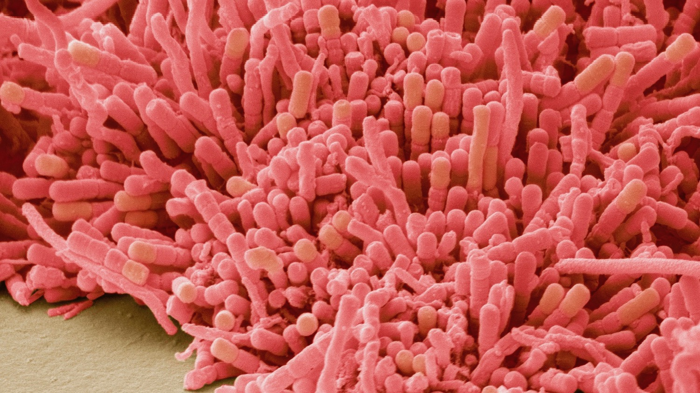
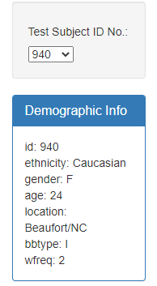
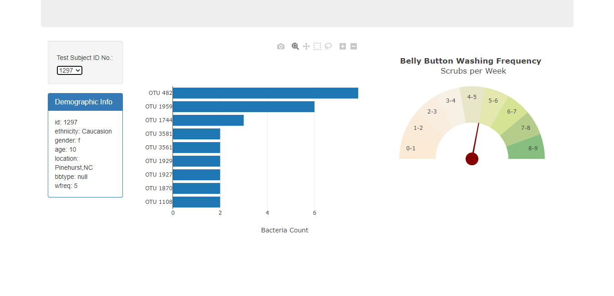
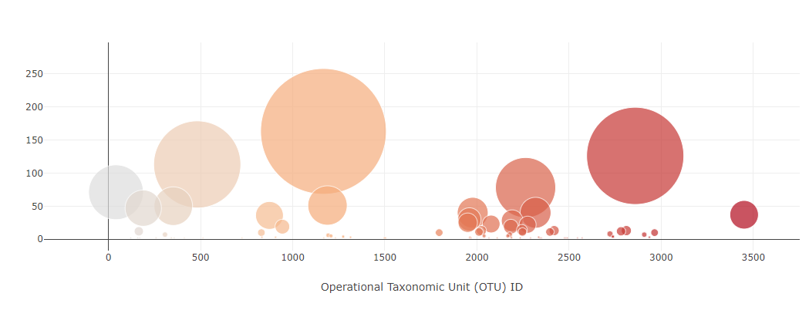

# Visualization of Biodiversity

For this project I built an interactive dashboard to explore a biodiversity dataset which catalogued microbes that colonize human navels. The dataset revealed that a small handful of microbial species (also called taxonomic units, or OTUs, in the study) were present in more than 70% of people while the rest were relatively rare. 

[Click here](https://tjjaramillo.github.io/Biodiversity-Visualization/) to view my interactive dashboard web page. This dashboard was created utilizing JSON data, Javascript, HTML, Bootstrap, and Plotly.

Using JSON data I created a dropdown menu to select specific patient numbers to reveal the bacterial composition of the sample obtained from each subject as well as display patient information. 

Created a barchart displaying the top 10 OTU's found in each subject selected by the dropdown menu along with a Guage Chart displaying the subjects' weekly washing frequency. 

Lastly, created a bubble chart that displays each cample for the selected subject.

